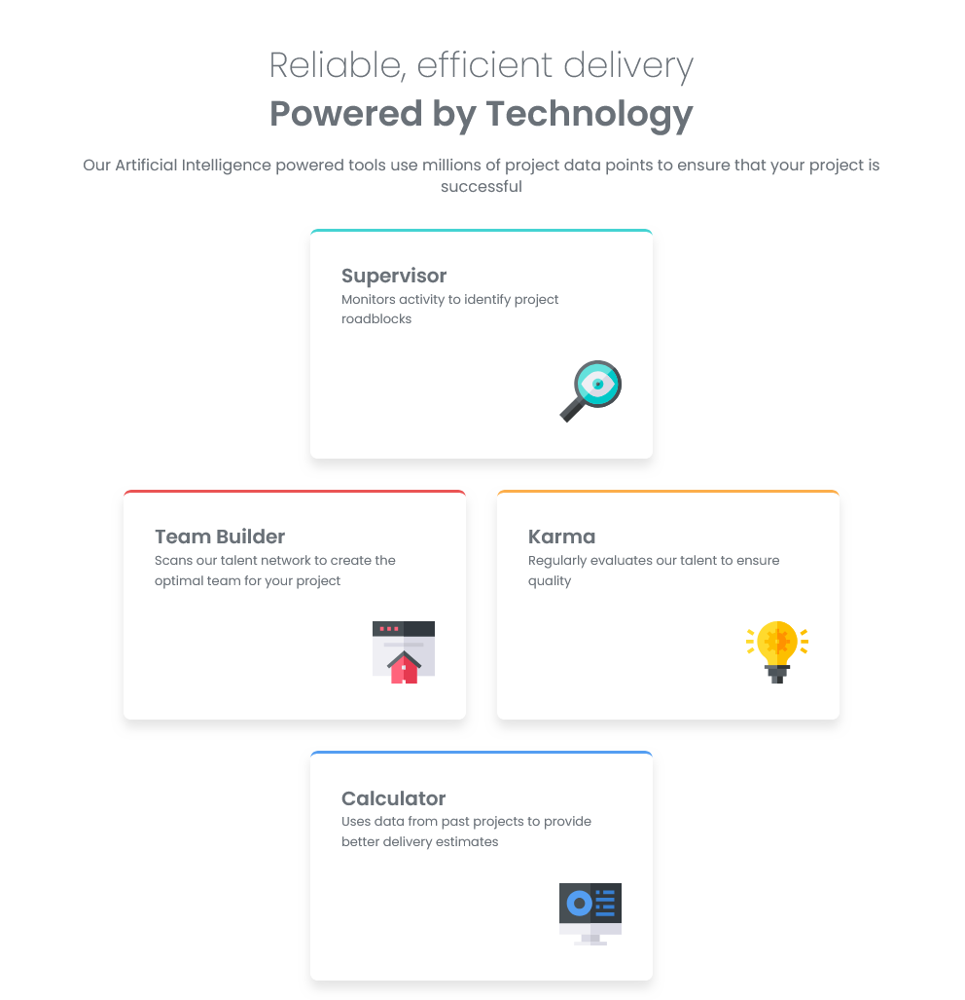

# Frontend Mentor - Four card feature section solution

This is a solution to the [Four card feature section challenge on Frontend Mentor](https://www.frontendmentor.io/challenges/four-card-feature-section-weK1eFYK). Frontend Mentor challenges help you improve your coding skills by building realistic projects. 

## Table of contents

- [Overview](#overview)
  - [The challenge](#the-challenge)
  - [Screenshot](#screenshot)
  - [Links](#links)
- [My process](#my-process)
  - [Built with](#built-with)
  - [What I learned](#what-i-learned)
  - [Useful resources](#useful-resources)
- [Author](#author)

## Overview

### The challenge

Users should be able to:

- View the optimal layout for the site depending on their device's screen size

### Screenshot

### Links

- <a href="https://github.com/gabei/Four-Card-Feature___FEM" target="_blank">Solution URL</a>
- <a href="https://gabei.github.io/Four-Card-Feature___FEM/" target="_blank">View the live site</a>

## My process

### Built with

- Semantic HTML5 markup
- CSS custom properties
- CSS Grid
- Mobile-first workflow
- Javascript

### What I learned

I'm usually more of a flexbox  guy, so I'm new to using grid. I can see that it has a lot to offer, and is understandably a standard in layour creation. I'd like to familiarize myself with it a little more and become a more fluent grid user.

### Useful resources

<a href="https://cssgridgarden.com/">Grid Garden: A game to learn CSS grid.</a>

## Author
- Frontend Mentor - <a href="https://www.frontendmentor.io/profile/yourusername" target="_blank">@gabei</a>
- GitHub - <a href="https://github.com/gabei" target="_blank">@gabei</a>
